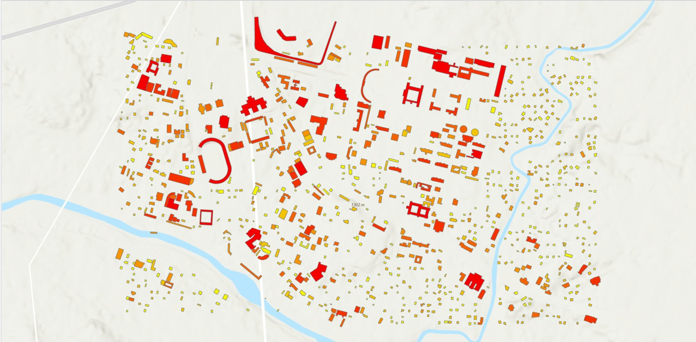

# Rooftop Solar Potential Across Data Environments

**One rooftop-solar method, two very different elevation-data realities: airborne LiDAR (Austin, Texas) and an open 30 m global DSM (Kathmandu, Nepal). The point of the project is to measure what coarsening the input data does to the answer.**


## The headline

Running the identical pipeline on 1 m airborne LiDAR (Austin) versus a 30 m open DSM (Kathmandu) shows the coarse surface systematically biases every step of a rooftop-solar estimate:

- **Roof slope is flattened.** Mean roof slope drops from 40.3 degrees on 1 m LiDAR to 3.7 degrees on the 30 m DSM. A 30 m cell averages an entire roof into near-flatness.
- **Usable area is overstated.** The fraction of roof passing the slope cap rises from 0.47 to 1.00. The coarse surface marks essentially all roof area as usable.
- **Small buildings vanish.** Footprint survival through the pipeline falls from 96% to 13%, so roughly 87% of small buildings are dropped at 30 m.

Together these inflate coarse-data solar estimates. The practical takeaway: an open-DSM rooftop-solar layer should be read as a **relative screen** (which buildings are worth a closer look), not as absolute design figures.

## Why this project exists

Most rooftop-solar GIS demos run a clean pipeline over a US city with high-quality airborne LiDAR and stop there. That is fine as a tutorial, but it hides the problem that defines this work in most of the world: the ideal data usually does not exist for your study area.

Nepal is a concrete case. Airborne LiDAR has been flown there, but it sits behind government and vendor gatekeeping and is not openly downloadable, so an honest "LiDAR rooftop solar for Nepal" project cannot be built from open data today. This project turns that constraint into the subject. It runs the same analytical method in two settings:

1. **Austin, Texas** with USGS 3DEP airborne LiDAR (1 m), to prove the full point-cloud-to-energy pipeline.
2. **Kathmandu, Nepal** with an open ~30 m global DSM plus OpenStreetMap footprints, to show what the method can and cannot deliver where LiDAR is absent, and to quantify the gap.

The deliverable is not "I can process LiDAR." It is "I can produce a usable energy analysis whether or not ideal data exists, and I can state precisely what is gained and lost when it is not."

## The method (shared across both cities)

```
elevation surface (DSM)
        |
        |-- slope (Horn 3x3)
        |-- aspect  --> aspect score (equator-facing = best; both cities N hemisphere)
        |
   building footprints (OSM)
        |
        v
 per-building zonal aggregation
        |
        v
 usable area  x  GHI  x  aspect score  x  panel efficiency  x  performance ratio
        |
        v
 estimated annual kWh per building
```

`src/solar_suitability.py` holds the shared slope/aspect and per-building logic. **Austin and Kathmandu call the identical functions.** Only the input surface and its resolution differ. That is the methods-transfer hinge, and it is what makes the comparison meaningful: the analysis is held constant so the data resolution is the variable under test.

## What is honestly different between the two cities

| | Austin (LiDAR) | Kathmandu (open DSM) |
|---|---|---|
| Surface source | USGS 3DEP airborne LiDAR | Copernicus GLO-30 / AW3D30 |
| Resolution | ~1 m | ~30 m |
| Roof planes resolved? | Yes (per-facet slope/aspect) | No (footprint-level screen only) |
| Footprints | OSM | OSM (urban core) |
| What the estimate means | Per-roof suitability | Per-building suitability screen |

The 30 m limitation is stated, not hidden. At 30 m you cannot recover the slope and aspect of an individual roof facet, so the Kathmandu output is a footprint-level screen, not a roof-design tool.

A second honesty note: open building-footprint datasets disagree for Kathmandu (OSM, Google Open Buildings, and Microsoft differ by roughly 50% in total building area), and OSM completeness is strong in the urban core but weaker in peri-urban and informal areas. The project uses OSM over the urban core and flags this sensitivity rather than treating the footprints as ground truth.

## On the comparison: natural, not yet controlled

This is a natural comparison between two cities, not a controlled experiment. Austin and Kathmandu differ in two ways at once: the elevation-data resolution (1 m vs 30 m) **and** the actual built environment (different building stock, density, and roof styles). The slope-flattening and area-inflation reported above are dominated by the resolution effect, but a portion is genuine difference between the two cities' roofs.

The clean controlled test, and the most important next step for this project, is to **degrade Austin's own 1 m DSM to 30 m and re-run the identical buildings.** That isolates resolution from city, because the building stock is then held constant. This is stated openly because the resolution-bias claim is stronger when its one confound is named rather than left for a reader to find.

## Statistical comparison

`src/comparative_analysis.py` computes distribution summaries and tests the two per-building solar distributions against each other (Mann-Whitney U and Kolmogorov-Smirnov), plus footprint-area-to-energy correlations and the slope/usable-fraction contrast that drives the bias. The computed results are saved in `images/stats.json`. `src/comparative_plots.py` renders the figures.


| Austin (1 m LiDAR) | Kathmandu (30 m open DSM) |
|---|---|
|  |  |

## Repository layout

```
lidar-rooftop-solar/
|-- environment.yml                  # conda env (PDAL, rasterio, geopandas, osmnx, ...)
|-- README.md
|-- src/
|   |-- point_cloud_to_surfaces.py   # Austin: LAZ -> DSM + DTM (PDAL)
|   |-- terrain_metrics.py           # optional: export slope/aspect rasters for QC
|   |-- solar_suitability.py         # SHARED slope/aspect + per-building estimate
|   |-- run_austin.py                # Austin run: OSM footprints + LiDAR DSM -> estimate
|   |-- run_kathmandu.py             # Kathmandu run: reproject open DSM + OSM -> estimate
|   |-- kathmandu_transfer.py        # Kathmandu transfer entry point (CLI)
|   |-- comparative_analysis.py      # comparative statistics -> stats.json
|   |-- comparative_plots.py         # distribution + resolution-bias figures
|-- notebooks/
|   |-- 01_run_pipeline.ipynb        # runs both ends, makes figures
|-- images/                          # writeup figures
```

Generated rasters, point clouds, and per-building GeoJSON outputs are not committed (see Data sources). Drop your own input tiles in a local `data/` folder as described below.

## How to run

### 0. Environment
```bash
conda env create -f environment.yml
conda activate rooftop-solar
```

### 1. Austin (LiDAR side)
Place a USGS 3DEP LAZ tile at `data/austin/tile.laz`. The script prints a point-cloud summary first; read the reported CRS and pass a projected, metre-based EPSG appropriate to that tile (do not assume one, verify it from the summary, because the correct CRS depends on the tile's location).

```bash
python src/point_cloud_to_surfaces.py \
    --laz data/austin/tile.laz \
    --out-dir outputs/austin \
    --resolution 1.0 \
    --epsg <projected metric EPSG for your tile>

# optional QC rasters
python src/terrain_metrics.py --dsm outputs/austin/dsm.tif --out-dir outputs/austin

# fetch OSM footprints + per-building estimate
python src/run_austin.py
```

### 2. Kathmandu (transfer side)
Download a Copernicus GLO-30 DSM for a small Kathmandu urban-core box, reproject to UTM 45N (EPSG:32645), save as `data/kathmandu/dsm.tif`, then:
```bash
python src/kathmandu_transfer.py \
    --dsm data/kathmandu/dsm.tif \
    --out outputs/kathmandu/buildings_solar.geojson \
    --bbox 27.69 85.30 27.73 85.34
```

### 3. Compare
```bash
python src/comparative_analysis.py     # writes stats.json
python src/comparative_plots.py        # writes the figures in images/
```

## Solar modelling note

The Python code computes the geometric suitability (slope, aspect, usable area) and a transparent first-order energy estimate: `usable_area x GHI x aspect_score x panel_efficiency x performance_ratio`. GHI values are site-specific long-term annual GHI from the Global Solar Atlas (Austin 1750.7, Kathmandu 1774.8 kWh/m2/yr). For the Austin side, a higher-fidelity insolation surface (sky-view, horizon shading, direct/diffuse split) can be produced in ArcGIS Pro's Area Solar Radiation tool on the 1 m DSM and swapped in. The split between a reproducible Python core and an optional higher-fidelity GIS step is intentional and documented rather than hidden.

## Data sources

- USGS 3DEP Lidar Point Cloud (public domain), via 3DEP LidarExplorer.
- Copernicus GLO-30 DSM / JAXA AW3D30 (open global elevation).
- OpenStreetMap building footprints (copyright OpenStreetMap contributors, ODbL).
- Global Solar Atlas v2.6 (Solargis / World Bank) for site GHI.

## Limitations (read before citing any number)

- The two-city comparison is natural, not controlled; resolution and city differ together (see the controlled-test note above).
- Kathmandu estimates are a footprint-level screen at 30 m, not roof-facet design.
- The energy model is first-order and does not model inter-building shading in Python; use ArcGIS Pro Area Solar Radiation on the LiDAR side for that.
- OSM footprint completeness and the choice of footprint dataset materially affect Kathmandu totals.

## License

Code released under the MIT License. Data under their respective licenses above.

---

*Author: Nirajan Tripathi, M.S. Geography (GIS and remote sensing), Texas State University.*
[Portfolio](https://nirajan550123.github.io/) · [LinkedIn](https://www.linkedin.com/in/nirajan-tripathi-5434a8308/) · [GitHub](https://github.com/nirajan550123)
